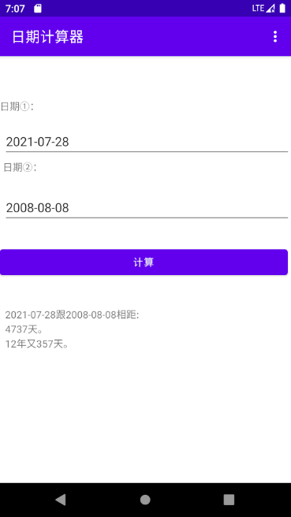

# DateCalculation

基于安卓的日期计算器

## 功能说明

本程序实现的功能为计算两个日期之间相距的天数。

注：在计算相差几年时，是用相距天数除以365得到的，所以实际结果会有偏差。例如2007-01-01和2013-01-01应该是相距6年整，但本程序的计算结果为相距6年又2天，原因在于中间出现了两个闰年，多了2008年2月29日和2012年2月29日。但相距天数绝对准确。另外如果输入2021-07-32这种错误日期，程序会自动帮你转成对应的2021-08-01进行计算。

## 程序截图

## 关于

作者:HibaraAi

版本:1.0

日期:2021-07-28

源码:https://github.com/HibaraAi/DateCalculation

